# Operationalizing an AWS ML Project

In this project, we will complete the following steps:

1. Train and deploy a model on Sagemaker, using the most appropriate instances. Set up multi-instance training in the Sagemaker notebook.
2. Adjust the Sagemaker notebooks to perform training and deployment on EC2.
3. Set up a Lambda function for the deployed model. Set up auto-scaling for the deployed endpoint as well as concurrency for the Lambda function.
4. Ensure that the security on the ML pipeline is set up properly.

## Step 1: Training and deployment on Sagemaker
- Screenshot of the AWS Sagemaker instance console, showing at least one instance that is created and running:
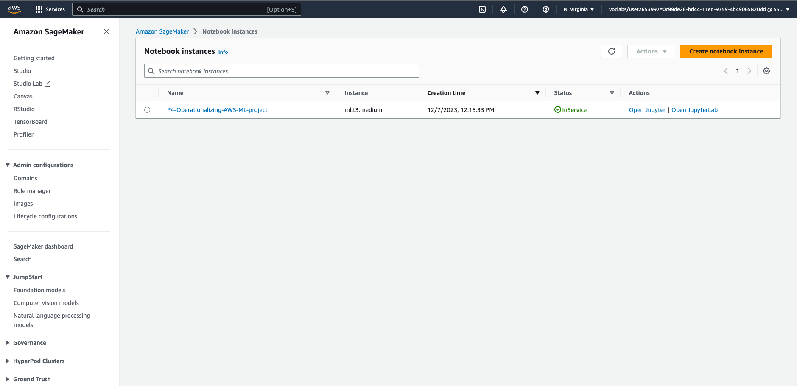

- Text in the writeup describes and justifies the student's choice:
A `ml.t3.medium` notebook instance is chosen to perform in this section with the instance details as below:  
```
Notebook instance type: ml.t3.medium
Volume size: 5GB EBS
Platform identifier: Amazon Linux 2, Jupyter Lab 3
Link to Git repository: https://github.com/hoang-phuong-nguyen/udacity-nd009t-C4-Operationalizing-an-AWS-ML-Project.git
```

- Screenshot shows S3 console with a created bucket:
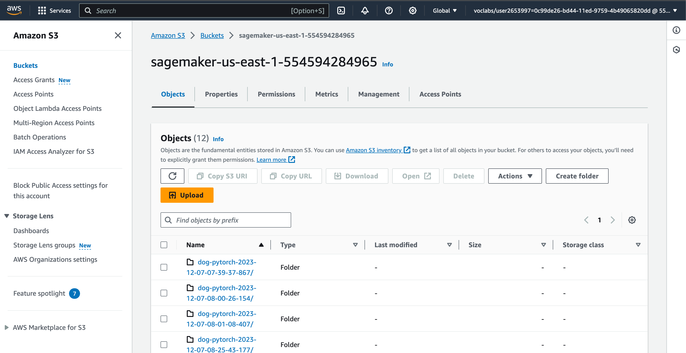

- Screenshot shows a deployed model in the Sagemaker "Inference" section:
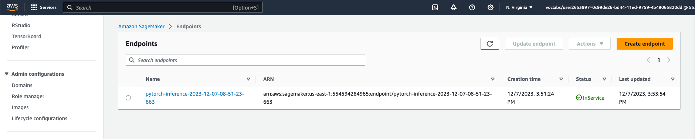

- Submitted notebook contains code for multi-instance training:
```
estimator = PyTorch(
    entry_point='hpo.py',
    base_job_name='dog-pytorch',
    role=role,
    instance_count=5, # increase the number of instance to 5 
    instance_type='ml.m5.xlarge',
    framework_version='1.4.0',
    py_version='py3',
    hyperparameters=hyperparameters,
    ## Debugger and Profiler parameters
    rules=rules,
    debugger_hook_config=hook_config,
    profiler_config=profiler_config,
)
```
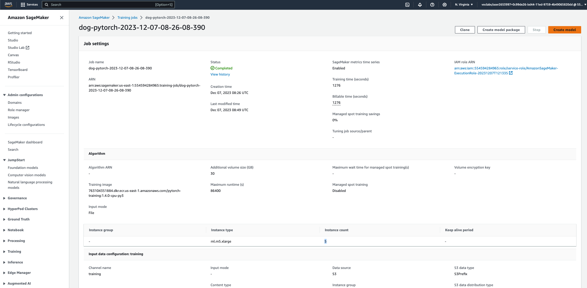
Further details can be found in the notebook `train_and_deploy-solution.ipynb`


## EC2 Training
- Writeup contains a description of the EC2 instance created, including justification for the chosen type
> **AMI: Deep Learning AMI GPU PyTorch 2.1.0**

As suggested from the course, I have selected a `Deep Learning AMI` with GPU and the latest version of Pytorch 2.1.0
> **Instance Type: m5.xlarge**

I have selected a `m5.xlarge` instance to be compatible with the training code in the notebook.

More details can be found in the below screenshot:
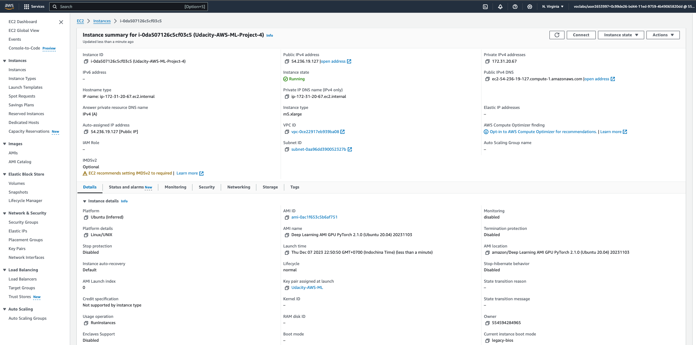


- Submitted Python file shows valid code for model training without importing any Sagemaker-specific modules (sagemaker, sagemaker.tuner, sagemaker.pytorch, or sagemaker.debugger)

The Python file for model training on the EC2 instance: [ec2train1.py](/ec2train1.py)

The main difference between the code in [ec2train1.py](/ec2train1.py) and the code we used in Step 1 is that the model hyperparameters in [ec2train1.py](/ec2train1.py) are predefined as below, while the ones in the Step 1 code were given from the input arguments.
```
batch_size=2
learning_rate=1e-4 
```
The model was trained on the EC2 instance using the above script:
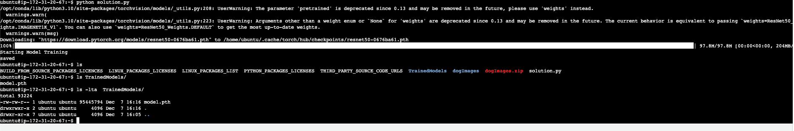

## Lambda function setup 
- A screenshot shows a deployed Lambda function, and a Python file contains a reference to the deployed endpoint, a defined response variable, and a valid return statement.
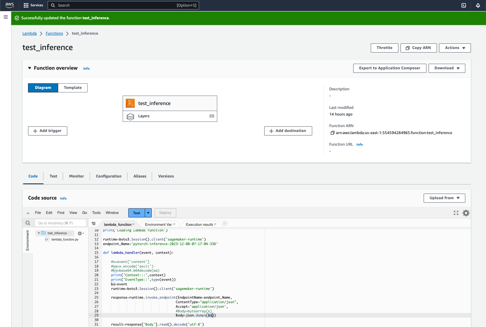

The Python file containing a reference to the deployed endpoint can be found at [lamdafunction.py](./lamdafunction.py)

## Security and testing
- A screenshot shows the "SagemakerFullAccess" security policy attached to the Lambda function.

The initial Lambda function does not have enough permissions to run the endpoint. Additional policies "SagemakerFullAccess" has to be added to Lambda in order to run it properly

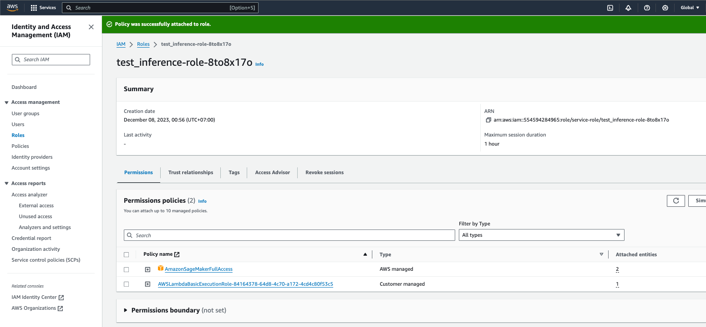

- Student provides the Lambda function response in the writeup
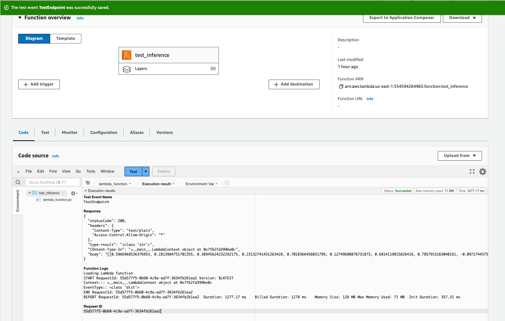

- The writeup contains a description of potential vulnerabilities in the IAM setup, including the following: roles that have "FullAccess" policies attached, roles that are old or inactive, and roles with policies for functions that the project is no longer using.

`FullAccess` can resolve authentication errors and many more, however it is prone to security risks from malicious actors. `Roles that are old and inactive` should be removed to mitigate any potential security risk. `Roles with policies for functions that the project is no longer using` should also be removed to mitigate any potential risk of unauthorized access. 

## Concurrency and auto-scaling
- The writeup clearly describes traffic, cost, and efficiency considerations for both concurrency and auto-scaling.

**Concurrency**
Concurrency allow Lamda functions to respond to multiple requests at the same time.
I have enabled the reserved concurrency mechanism up to 5 instances as below:
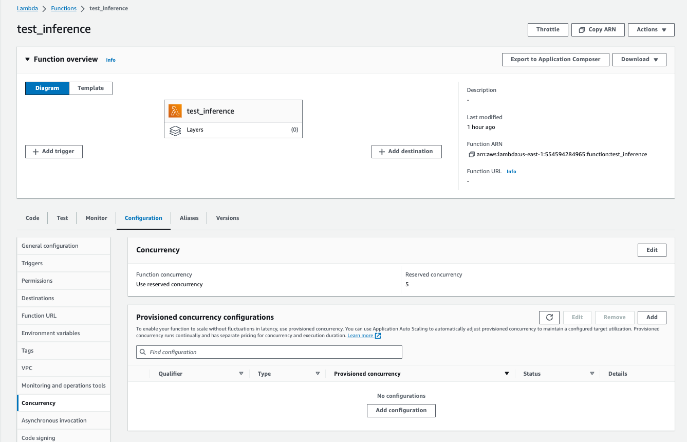

**Autoscaling**
Autoscaling allows the deployed Endpoints to respond to multiple requests at the same time. 
I have enabled the Endpoint's autoscaling mechanism, and selected a maximum number of instances to be 3 with both the cool-down scale-in and scale-out of 30 seconds as below:
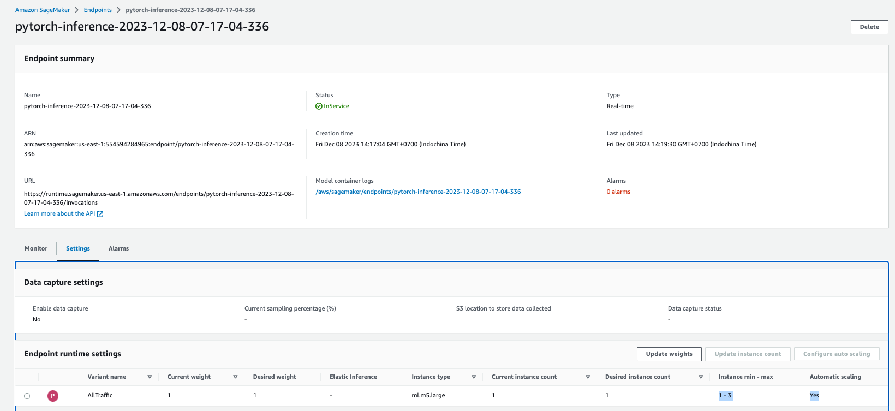
